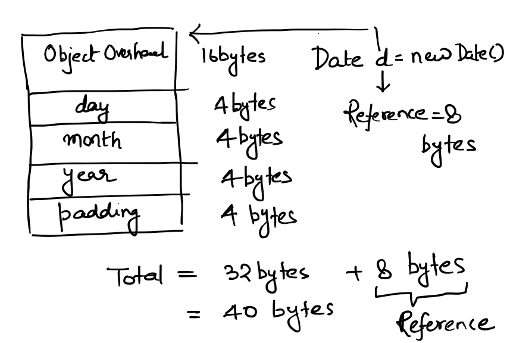
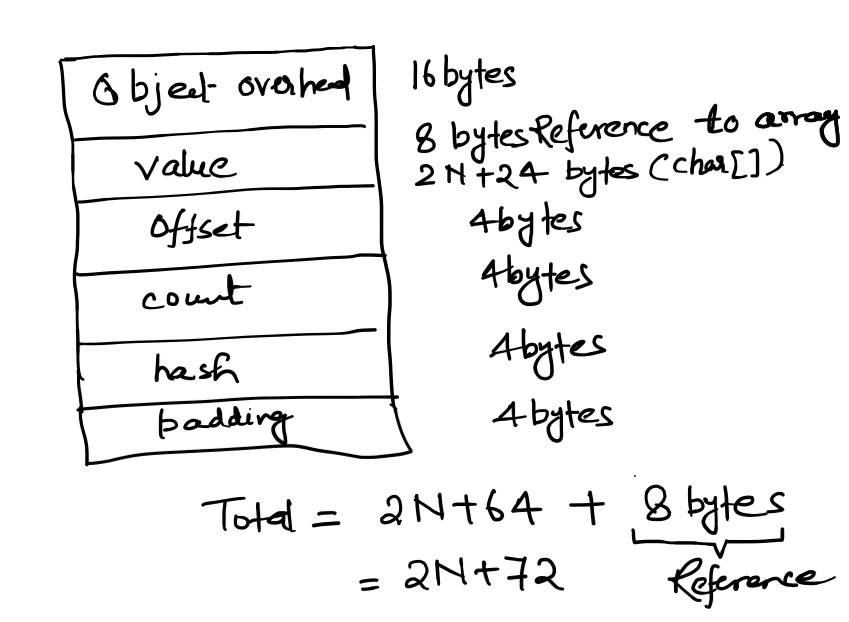

# Analysis of Algorithm

Writing an algorithm we are also concerned about its running time and memory consumption. Although we cannot get exact values but we can calculate approximate values.

# Dependency of running time and memory of Algorithm

- System Independent
    - Algorithm Logic
    - Input
	
- System Dependent
    - Hardware: CPUs, Memory etc
    - Software: Compiler, Interpreter, Garbage Collector etc
    - System Software: OS, Network etc
	
# Mathematical Models

# Running Time Analysis

### 2-Sum Problem

Running time of Algorithm is written as function of N i.e. T(N). For every operation in algorithm we mention some constant time and when all those operations are added with the algorithmic logic it gives running time as function of input size.

For example for 2-sum problem:

```Java
for(int i=0; i<N-1; i++){        // Assignment Operation: c1, Comparison Operation: c2, Increament Operation: c3  and happens N-1 times
	for(j=i+1; j<N; j++){     // Assignment Operation: c1, Comparison Operation: c2, Increament Operation: c3  and happens (i+1) to (N-1) times
		if(a[i]+a[j] == 0) // Assignment Operation: c1, Sum Operation: c4 and happens for all combination of i and j 
			count++;
	}
}
```

In above brute-force 2-Sum algorithm,

- i=0, j=1,2,3, ..., N-1 -> (N-1) comparisons within inner loop
- i=1, j=2,3, ..., N-1   -> (N-2) comparisons within inner loop

- i=N-2, j=N-1           -> 1     comparison within inner loop

Total Comparisons = T(N) = 1 + 2 + ... + (N-1) = (N-1) * N/2

But when same 2-Sum problem is written in optimized way then

```Java
Arrays.sort(a);
int count = 0;
int i = 0;
int j = a.length - 1;
while(i < j && a[i] < 0)
	if(Math.abs(a[i]) < Math.abs(a[j]))
		j--;
	else if(Math.abs(a[i]) > Math.abs(a[j]))
		i++;
	else {
		System.out.println("["+a[i]+","+a[j]+"]");
		count++;
		
		// If uniqueness not required, following two loops are not required
		while(j >= 0 && a[j] == a[j-1])  // Ignore unique from right  
			j--;
		
		while(i <= a.length-1 && a[i] == a[i+1])  // Ignore unique from left
			i++;				
		
		j--;
		i++;
	}
return count;
```

Sorting has been done first which will take N*log N. Then the traversal has been done from both side of sorted array in linear fashion which may take N/2 time.

Hence same problem solved in optimized way can take T(N) = N * log N time.

### Binary Search Problem

```Java
Integer lo = 0;
Integer hi = a.length - 1;
while(lo <= hi) {

	//Integer mid = lo + (hi - lo)/2;
	Integer mid = (lo + hi)/2;
	if(a[mid] == k)
		return mid;
	else if(a[mid] > k)
		hi = mid-1;
	else
		lo = mid+1;
}
return -1;
```

Lets assume T(N) takes to solve the problem of size N in case of BinarySearch. Then we divide the problem in half which is done by one comparison operation.

T(N) = T(N/2) + 1
     = T(N/4) + 2
     = T(N/8) + 3
     ...
     = T(1)   + k
     
N/2<sup>k</sup> = 1 => k = log<sub>2</sub> N 

Hence Binary Search can be solved in k + 1 operations i.e. T(N) = log<sub>2</sub>N + 1

# Types of Running Time Analysis

### Best case. Lower bound on cost.
- Determined by “easiest” input. 
- Provides a goal for all inputs.

### Worst case. Upper bound on cost.
- Determined by “most difficult” input. 
- Provides a guarantee for all inputs.

### Average case. Expected cost for random input.
- Need a model for “random” input. 
- Provides a way to predict performance.

Example:
For Binary Search 
- Best Case ~ 1
- Average Case ~ log<sub>2</sub>N
- Worst Case ~ log<sub>2</sub>N

# Memory Analysis

Other than Running time of a given algorithm it is important to know the memory consumption by the program. Here example of Java has been taken. 

Java data types consume following memory:

<table style='width:50%;text-align: left'>
<tr><th>Data Types</th><th> Array</th></tr>
<tr>
<td>
	<table style='border: 1px black solid; border-collapse: collapse'>
		<tr><th style='border: 1px black solid'>type</th><th style='border: 1px black solid'>bytes</th></tr>
		<tr><td style='border: 1px black solid'>boolean</td><td style='border: 1px black solid'>1 bit</td></tr>
		<tr><td style='border: 1px black solid'>byte</td><td style='border: 1px black solid'>1</td></tr>
		<tr><td style='border: 1px black solid'>char</td><td style='border: 1px black solid'>2</td></tr>
		<tr><td style='border: 1px black solid'>int</td><td style='border: 1px black solid'>4</td></tr>
		<tr><td style='border: 1px black solid'>float</td><td style='border: 1px black solid'>4</td></tr>
		<tr><td style='border: 1px black solid'>long</td><td style='border: 1px black solid'>8</td></tr>
		<tr><td style='border: 1px black solid'>double</td><td style='border: 1px black solid'>8</td></tr>
	</table>
</td>
<td>
	<table style='border: 1px black solid; border-collapse: collapse'>
		<tr><th style='border: 1px black solid'>type</th><th style='border: 1px black solid'>bytes</th></tr>
		<tr><td style='border: 1px black solid'>char[]</td><td style='border: 1px black solid'>2N + 24</td></tr>
		<tr><td style='border: 1px black solid'>int[]</td><td style='border: 1px black solid'>4N + 24</td></tr>
		<tr><td style='border: 1px black solid'>double[]</td><td style='border: 1px black solid'>8N + 24</td></tr>
	</table>
</td>
</tr>
</table>


Object of Date class memory consumption will be calculated as follows: 

```Java
public class Date{
	private int day;
	private int month;
	private int year;
	//...
}
```

<p align="center">
  
</p>

Object of String class memory consumption will be calculated as follows:
 
```Java
public class String{
	private char[] value;
	private int offset;
	private int count;
	private int hash;
	//...
}
```

<p align="center">
  
</p>

# Conclusion
Hence as described above the Approximate Running Time Analysis and Memory Analysis can be done using Mathematical Models. 

 
 
 


 