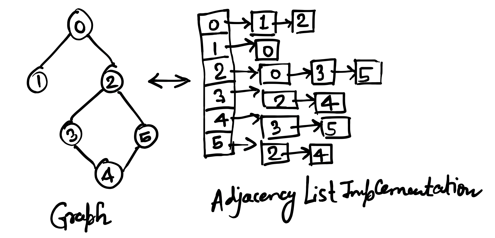
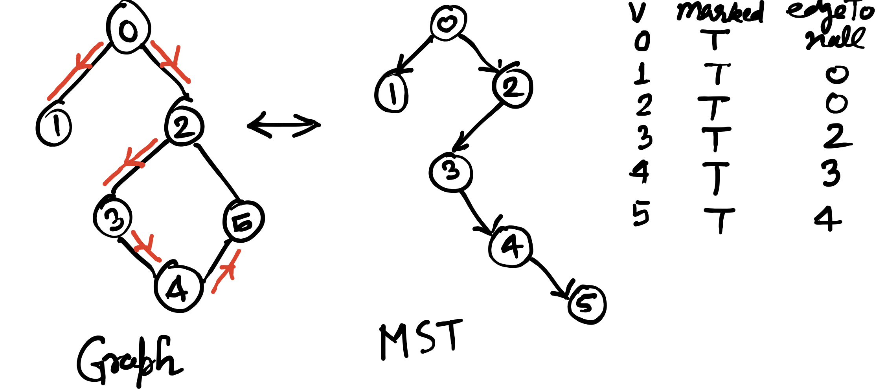
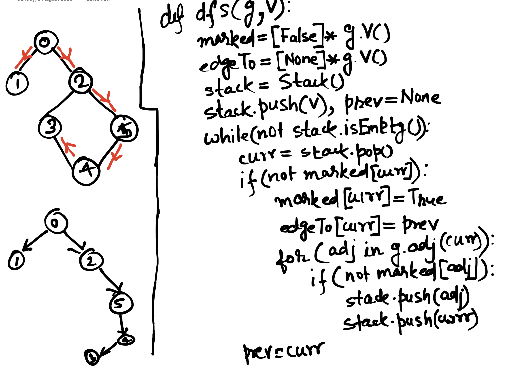
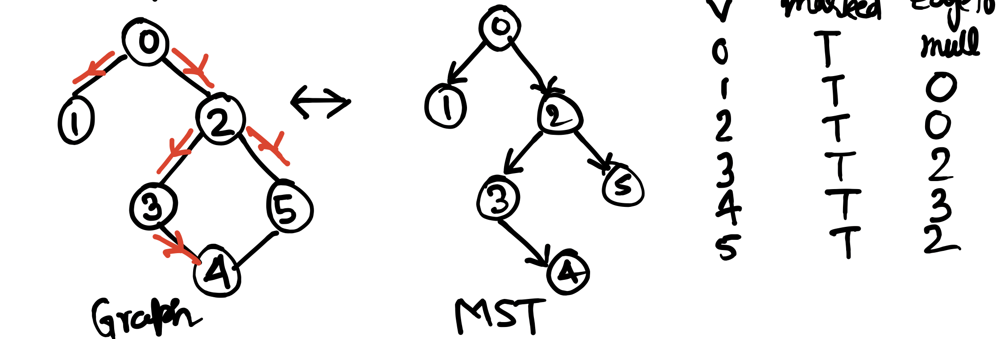

# Graph 

Graph data structure is a set of Edges and Vertices. It has following practical usage:

- Distributed computing as DAG
- Internet routing and connectivity between computers
- Social Network(Like Facebook, LinkedIn etc)
- Machine Learning Algorithm like Neural Networks etc

### Implementation

Adjacency List implementation has been used here. Which is much more cost effective compared to Adjacency Matrix or edges as list.


<p align="center">
  
</p>

Index of array *adj* in *Graph* object represents each vertex and the content of array is a *List<Integer>* contains all vertices adjacent to current vertex.
 
```Java
private List<Integer>[] adj;
```

For adding an edge in a graph object following method is used

```Java
public void addEdge(int v, int w){
	validateVertex(v);
	validateVertex(w);
	adj[v].add(w);
	adj[w].add(v);
	E++;
}
```

### Helper Methods

Following helper method returns adjacent vertices to a given vertex.

```Java
public List<Integer> adj(int v){
	validateVertex(v);
	return this.adj[v];
}
```

Following helper method returns degree(number of edges attached) of a given vertex.

```Java
public int degree(int v) {
	validateVertex(v);
	return adj[v].size();
}
```

# Graph Traversal

Depth first search(DFS) and Breadth first Search(BFS) are the two traversal techniques has been used. Both can be used to identify whether a path exists between a source vertex and other vertices of the graph. 

To make implementation DFS and BFS, Paths interface has been used. *hasPathTo(int v)* tells whether there is a path between source and destination vertex or not. *pathTo(int v)* gives the path from source to destination. 

```Java
public interface Paths {
	Boolean hasPathTo(int v);
	Iterable<Integer> pathTo(int v);
}
```

Client application has to call specific implementation in following way to check the connectivity between source vertex and all destination vertex. Also we can get paths from source to all destination vertex.


```Java
Paths paths = new DfsPaths(g, 0);
for(int i=1; i<g.V(); i++) {
	System.out.println(dfsPaths.hasPathTo(i));
	System.out.println(dfsPaths.pathTo(i));
}

Paths bfsPaths = new BfsPaths(g, 0);
for(int i=1; i<g.V(); i++) {
	System.out.println(bfsPaths.hasPathTo(i));
	System.out.println(bfsPaths.pathTo(i));
}
```

### DFS

Depth first search is less efficient Graph Traversal Technique. Reason is total time taken to traverse is equal to **sum of degrees** of all vertices. Also the path returned from DFS is not guaranteed to be shortest path between source and destination node. 

The implementation here is recursive but it can be done using Stack as well.

```Java
private void dfs(Graph g, int vertex) {
	this.marked[vertex] = true;		
	for(int ver : g.adj(vertex)) {
		if(!marked[ver]) {
			this.marked[ver] = true;
			this.edgeTo[ver] = vertex; 
			dfs(g, ver);				
		}
	}
}
```

<p align="center">
  
</p>

Properties:

- Time taken by DFS is sum of the degree of all nodes
- Once DFS is executed, whether two nodes are connected to each other can be identified in constant time
- Once DFS is executed, path between two nodes can be identified in linear time i.e. equal to path length
- Each and every vertex only visited only once

### DFS(Stack based)

Depth first search can also be implemented using stack. It is implemented in DfsStackPaths class.

<p align="center">
  
</p>

### BFS

Breadth first search is more efficient Graph Traversal Technique compared to DFS.

```Java
private void bfs(Graph g, int sourceVertex) {
	queue.add(sourceVertex);
	marked[sourceVertex] = true;
	while(!queue.isEmpty()) {
		Integer vertex = queue.remove();
		for(Integer adjVertex : g.adj(vertex)) {
			if(!marked[adjVertex]) {
				queue.add(adjVertex);
				marked[adjVertex] = true;
				edgeTo[adjVertex] = vertex;
			}
		}
	}
}
```


<p align="center">
  
</p>

Properties:

- The path given by BFS is the shorted path between the vertices

# Connected Components

If a graph has many smaller disconnected graphs, Connect Components algorithm gives the nodes of graph which are connected to each other and for each connected graph provides an id. So we can see all nodes/vertices within a connected component of a graph. 

CCClient code shows how to run Connected Component algorithm by passing a graph as follows. Also after that we can get total count of connected components by calling count() on the cc object. 

```Java
CC cc = new CC(g);
System.out.println(cc.count());
```

Following code snippet in CCClient shows how can we get all vertices within a connected component.

```Java
for(int i=0; i<cc.count(); i++) {
	System.out.println(cc.verticesInCC(i));
}
```

On the other side following code snippet show how can we get the connected component each vertex belong to.

```Java
for(int v=0; v<g.V(); v++) {
	System.out.println(v+"-->"+cc.cc(v));
}
```

# Graph Problems

### Identifying graph is Bipartite?

If graph vertices can be divided into two sets such that there is no direct edge between vertices of the individual sets. On the other side, there is only edge between vertices from one set to another set. 

We can identify this easily by coloring the vertices by two colors when we traverse the graph(either of the two traversals BFS and DFS). If two adjacent vertices are colored with same color, then it will not a bipartite graph.

Code snippet in BFS:

```Java
public static Boolean isBipartite(Graph g, int v) {
	Boolean[] marked = Collections.nCopies(g.V(), false).toArray(new Boolean[0]);
	COLOUR[] coloured = Collections.nCopies(g.V(), null).toArray(new COLOUR[0]);
	Queue<Integer> queue = new LinkedList<Integer>();
		
	marked[v] = true;
	coloured[v] = COLOUR.WHITE;
	queue.add(v);
		
	while(!queue.isEmpty()) {
		int vertex = queue.remove();
		for(int adj:g.adj(vertex)) {
			if(marked[adj] && coloured[adj] == coloured[vertex]) {
				return false;
			}
			if(!marked[adj]) {
				marked[adj] = true;
				coloured[adj] = complement(coloured[vertex]);
				queue.add(adj);
			}
		}
	}
	return true;
}
```

Code snippet in DFS:

```Java
public static Boolean isBipartite_dfs(Graph g, int v) {
	Boolean[] marked = Collections.nCopies(g.V(), false).toArray(new Boolean[0]);
	COLOUR[] coloured = Collections.nCopies(g.V(), null).toArray(new COLOUR[0]);
		
	coloured[v] = COLOUR.WHITE;
	return dfs(g, v, marked, coloured);
		
}
	
private static Boolean dfs(Graph g, int v, Boolean[] marked, COLOUR[] coloured) {	
	marked[v] = true;
	for(int adj:g.adj(v)) {
		if(marked[adj] && coloured[adj] == coloured[v]) {
			return false;
		}
		if(!marked[adj]) {
			marked[adj] = true;
			coloured[adj] = complement(coloured[v]);
			if(!dfs(g, adj, marked, coloured)) {
				return false;
			}
		}
	}
	return true;
}
```

### Is cycle exists?

This problem can be solved by DFS. If a vertex is being visited and one of it adjacent is already visited provided that the adjacent should not be the one from where we came to current vertex then we can say there is a cycle in the graph.

```Java
public static Boolean hasCycle(Graph g, Integer v, Boolean[] marked, Integer[] edgeTo) {
		marked[v] = true;
		for(Integer adj:g.adj(v)) {
			if(marked[adj] && v!=null && adj!=null && edgeTo[v] != adj)
				return true;
			if(!marked[adj]) {
				edgeTo[adj] = v;
				return hasCycle(g, adj, marked, edgeTo);
			}
		}
		return false;
	}
```

### Euler Cycle: Is there a cycle which visits every edge only once?

This problem can be solved using DFS in linear time. A graph whose every vertex is having even degree then there will be definitely one cycle which visits every edge once. Finding this cycle is possible by DFS.


### Hamiltonian Cycle or Travelling Sales Person Pronlem: Is there a cycle exists which visits every vertex once?

This is NP-Complete problem and there is no efficient mechanism to solve it. 

### Two graphs are identical or not?

There is no efficient mechanism to identify whether two graphs are identical or not. First of all name of the vertex of one graph need to be changed and then each and every edge need to be compared. There are n! way to arrange the vertex  which is very large for large graphs.
 


 