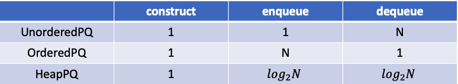
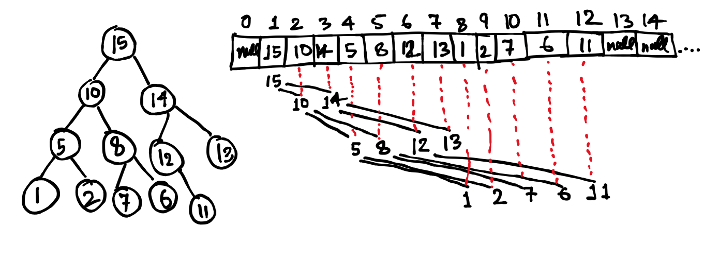

# Priority Queue

Priority Queue is similar to normal queue. But it does not follow FIFO, instead while enqueue it gives element with highest priority. Defining priority could be in multiple ways. For example element which is maximum.

### Implementations

There can be different implementations of Priority Queue. They have different merits and demerits. 

### Unordered Priority Queue

Look the class **UnorderedPQ**. The elements can be stored in an array which contains elements in unordered fashion. For simplicity fixed size array has been considered. But the same can be extended to dynamic size array.

#### Construct

An array of fixed size is created. Defining the size/capacity which queue can hold. Also a variable N which indicates number of elements currently in the queue.

```Java
public UnorderedPQ(int capacity) {
	this.data = (Key[])new Comparable[capacity];
	N = 0;
	SIZE = capacity;
}
```

#### Enqueue Operation

Enqueue takes constant time. Because we are not maintaining any order. So if space is there in Queue then element is added.

```Java
public void enqueue(Key key) throws QueueFullException{
	if(N == SIZE) throw new QueueFullException("Queue is full!!");
	data[N++] = key;
}
```

#### Dequeue Operation

Since the element has to be dequeued is the element with max priority, hence the element which is maximum has to be identified and returned. The space created because of the maximum element has been dequeued hence all the elements have to be shifted by one to left. The operation of identifying max and shifting elements to left takes T(N) = O(N).

```Java
public Key dequeue() throws QueueEmptyException{
	if(isEmpty()) throw new QueueEmptyException("Queue is empty!!");
	int max = 0;
	for(int i = 1; i < N; i++) 
		if(PQHelper.less(data[max], data[i])) 
			max = i;
	Key element = data[max];	
	for(int i = max; i < N-1; i++)
		data[i] = data[i+1];
	data[--N] = null;                
	return element;
}
```
### Ordered Priority Queue

Look the class **OrderedPQ**. The elements are stored in an array which contains elements in ordered fashion. For simplicity fixed size array has been taken. But the same can be extended to dynamic size array.

#### Construct

An array of fixed size is created. Defining the size/capacity which queue can hold. Also a variable N which indicates number of elements currently in the queue.

```Java
public OrderedPQ(int capacity) {
	this.SIZE = capacity;
	this.data = (Key[]) new Comparable[capacity];
	this.N = 0;
}
```

#### Enqueue Operation

Since order has to be maintained hence Enqueue need to identify where the incoming element fits in the array. Hence first the index is identified where element will be inserted. Also other elements have to be shifted to right. Hence in Ordered priority queue the T(N) = O(N). 

```Java
public void enqueue(Key key) throws QueueFullException {
	if(this.N == this.SIZE) throw new QueueFullException("Queue is full!!");
	int idx = 0;
	for(; idx < N; idx++) 
		if(PQHelper.less(key, data[idx])) break;
	N++;
	for(int i = N-1; i > idx; i--)
		data[i] = data[i-1];	
	data[idx] = key;
}
```

#### Dequeue Operation

Since maximum element is already at the end of array hence dequeue operation takes constant time.

```Java
public Key dequeue() throws QueueEmptyException {
	if(isEmpty()) throw new QueueEmptyException("Queue is empty");
	Key key = data[--N];
	data[N] = null;
	return key;
}
```

### Heap Based Priority Queue

Look the class **HeapPQ**. Heap based Priority Queue uses MaxHeap as underlying data structure to store the data. The reason is simple, the other two implementations of Priority Queue(Ordered and Unordered implementations) take constant time for one operation and linear time for other. By using Heap based implementation both operations enqueue/dequeue takes O(log<sub>2</sub>N) time. Which makes both operations fast. Please refer to **MaxHeap** data type latter in the same document.

#### Construct

Similar to Ordered and Unordered implementations of Priority Queue construction of Priority Queue which is Heap based can be done in constant time. It utilizes the construct of MaxHeap data structure.


```Java
public HeapPQ(int capacity) {
	heap = new MaxHeap<>(capacity);
}
```

#### Enqueue Operation

Uses the insertKey(key) function of MaxHeap data structure. This operation takes O(log<sub>2</sub>N) time because insertKey(key) takes O(log<sub>2</sub>N) time. Please MaxHeap data structure on this page.

```Java
public void enqueue(Key key) throws QueueFullException {
	try {
		this.heap.insertKey(key);
	} catch (HeapFullException e) {
		throw new QueueFullException("Queue is full!!");
	}
}
```

#### Dequeue Operation

Similar to enqueue operation, dequeue operation also takes O(log<sub>2</sub>N) time. It uses delMax() operation of Max Heap data Structure. Please MaxHeap data structure on this page.

```Java
public Key dequeue() throws QueueEmptyException {
	try {
		Key key = this.heap.delMax();
		return key;
	} catch (HeapEmptyException e) {
		throw new QueueEmptyException("Queue is empty!!");
	}
}
```

### Comparisons

Following table clearly shows difference between the time taken by different operations for all the implementations of priority queue.



### Usage of Priority Queue

- Dijkstra Algorithm
- Prim's Algorithm
- Data Compression(used in Huffman Codes which is used to compress data)
- Load Balancing(on OS or Server), interrupt handling

# MaxHeap

MaxHeap data structure is a data structure which is binary tree whose root is bigger than its subtree values. Statement is true for all its subtrees. The binary tree which represents the heap should be a complete binary tree other than its last layer. Please refer class **MaxHeap**.

MaxHeap is represented by array based data structure instead of maintaining like a Binary Tree node kind of structure.



As shown in above diagram:

- Data is kept from position 1 in instead of 0. The first key at position 1 is the maximum key.
- Children of Key at position k will be at position 2k and 2k+1 in the array
- Parent of key at position k will be at position k/2(integer) in the array

### Implementation

#### Construct

Construction mainly contains three parts. Initializing an array which can contain elements equal to capacity of heap. Also they should be comparable. We also define capacity of heap by variable called size and a variable N which indicates current number of elements in heap.

```Java
public MaxHeap(int capacity) {
	this.data = (Key[])new Comparable[capacity+1];
	this.SIZE = capacity;
	this.N = 0;
}
```

#### insertKey

insertKey is an operation of inserting a new key in the heap without violating the heap property. Hence it is done in two steps:

- Element is always added to end of array or end of the heap 
- To make sure heap property is not violated, a helper function **swim(N)** is called. 

```Java
public void insertKey(Key key) throws HeapFullException{
	if(N == SIZE) throw new HeapFullException("Heap is full!!");
	data[++N] = key;
	swim(N);
}
```
As name suggests swim(N) keeps on checking whether the element is lesser than its immediate parent or not, if it is bigger then exchange operations are done to move the element up in the tree to its right position, so that heap property can be made intact. Lets see the swim operation now,

```Java
private void swim(int idx) {
	while(idx > 1) {
		if(!less(idx/2, idx)) break;
		exchange(idx/2, idx);
		idx = idx/2;
	}
}
```

#### delKey

As name suggest this operation returns the maximum key of the heap and removing it from the heap. This operation is implemented as follows:

- The max key is never deleted directly from array although we know it exists at index 1. But first the max key is exchanged with its last element N of the array. So after this exchange last key is at position 1 and max key is at position N.
-  Now we are in a position to return the max key by deleting it from position N  and reducing N--.
- But since now last key is at position 1 hence heap property can be violated hence we take help of **sink(1)** operation to make sure again heap property is intact.

```Java
public Key delMax() throws HeapEmptyException{
	if(isEmpty()) throw new HeapEmptyException("Heap is empty!!");		
	exchange(1, N);
	Key key = data[N];
	data[N--] = null;
	sink(1);
	return key;
}
```

As name suggest sink operations keep on exchanging the element down until the heap property has been restored as shown below:

```Java
private void sink(int idx) {
	while(2*idx <= N) {
		int j = 2*idx;
		if(j < N && less(j, j+1)) j++;
		if(!less(idx, j)) break;
		exchange(idx, j);
		idx = j;
	}
}
```

### Usage of Heap

- To implement Priority Queue and all those applications where priority queue is used
- To implement heap sort


# Problems

- Identify median (find the median in constant time and remove it in logarithmic time)
- Randomized Priority Queue
- Taxicab Numbers (Find all taxicab numbers with a,b,c,d less than n)


