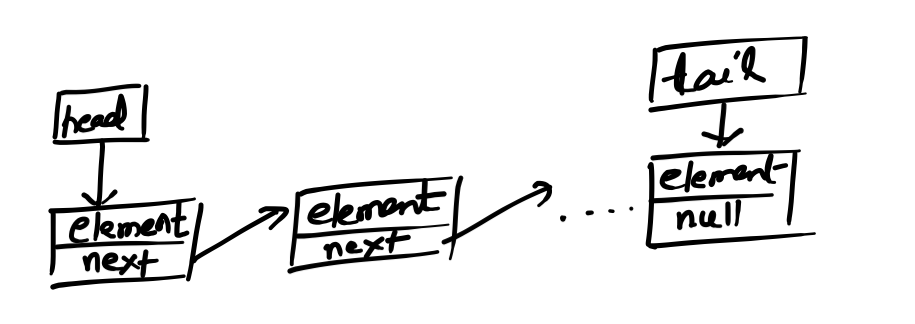

# Queue

Queue is a data structure in which the elements are kept or accessed in FIFO(First in First Out) order.

# Queue ADT

```Java
public interface Queue<T> {
	public void enqueue(T element);
	public T dequeue() throws EmptyQueueException;
	public int size();
	public boolean isEmpty();
}
```

# Linked List Based Queue

LinkedList based queue can be visualized as follows:

<p align="left">
  
</p>

#### - Time Analysis

All operations of LinkedListBasedStack implementation can be done in constant time. There are two pointers **head** and **tail** which represents head & tail of the Queue. 

<table style='border: 1px black solid; border-collapse: collapse'>
	<tr>
		<th style='border: 1px black solid'>Operation</th>
		<th style='border: 1px black solid'>Best Case</th>
		<th style='border: 1px black solid'>Worst Case</th>
		<th style='border: 1px black solid'>Amortized Time</th></tr>
	<tr>
	<tr>
		<td style='border: 1px black solid'>construct</td>
		<td style='border: 1px black solid'>1</td>
		<td style='border: 1px black solid'>1</td>
		<td style='border: 1px black solid'>1</td>
	</tr>
	<tr>
		<td style='border: 1px black solid'>enqueue</td>
		<td style='border: 1px black solid'>1</td>
		<td style='border: 1px black solid'>1</td>
		<td style='border: 1px black solid'>1</td>
	</tr>
	<tr>
		<td style='border: 1px black solid'>dequeue</td>
		<td style='border: 1px black solid'>1</td>
		<td style='border: 1px black solid'>1</td>
		<td style='border: 1px black solid'>1</td>
	</tr>
	<tr>
		<td style='border: 1px black solid'>size</td>
		<td style='border: 1px black solid'>1</td>
		<td style='border: 1px black solid'>1</td>
		<td style='border: 1px black solid'>1</td>
	</tr>
</table>		

#### - Space Analysis

The space/memory consumed by a linked list based array will be ~32N. 

<p align="left">
  
</p>

# Array Based Queue

Array based queue can be visualized as follows:

<p align="left">
  
</p>

In ArrayBased Queue, the underlying array is doubled in size if queue is full and we need to enqueue a new item. While dequeue, if the size of queue is (1/4)<sup>th</sup> of underlying array the array size is reduced to half. 


#### - Time Analysis

ArrayBased Queue implementation takes constant amortized time. We can refer to amortized time analysis of Array Based implementation  of Stack and we can see it takes O(1) time as shown below.

<p align="left">
  
</p>

<table style='border: 1px black solid; border-collapse: collapse'>
	<tr>
		<th style='border: 1px black solid'>Operation</th>
		<th style='border: 1px black solid'>Best Case</th>
		<th style='border: 1px black solid'>Worst Case</th>
		<th style='border: 1px black solid'>Amortized Time</th></tr>
	<tr>
	<tr>
		<td style='border: 1px black solid'>Construct</td>
		<td style='border: 1px black solid'>1</td>
		<td style='border: 1px black solid'>1</td>
		<td style='border: 1px black solid'>1</td>
	</tr>
	<tr>
		<td style='border: 1px black solid'>Enqueue</td>
		<td style='border: 1px black solid'>1</td>
		<td style='border: 1px black solid'>N</td>
		<td style='border: 1px black solid'>1</td>
	</tr>
	<tr>
		<td style='border: 1px black solid'>Dequeue</td>
		<td style='border: 1px black solid'>1</td>
		<td style='border: 1px black solid'>N</td>
		<td style='border: 1px black solid'>1</td>
	</tr>
	<tr>
		<td style='border: 1px black solid'>size</td>
		<td style='border: 1px black solid'>1</td>
		<td style='border: 1px black solid'>1</td>
		<td style='border: 1px black solid'>1</td>
	</tr>
</table>	

#### - Space Analysis

For Queue which contains elements of Integer type can occupy space somewhere between N to 4N.

<p align="left">
  
</p>

# Which to pick

Between the two kinds of queues of dynamic size which to pick is all depends on what is the requirement of client. 

If frequency of enqueue followed by dequeue is not high then we may use ArrayBasedQueue because over a period of time the average operations time taken is constant time. Also the space consumption is 1/8 of the space consumed by LinkedListBasedQueue. Hence lets say if we want to use queue in a mobile app where Memory is a constraint we can use ArrayBasedQueue because it takes 1/8th of Memory and with descent speed.

If there are too many enqueue and then dequeue operations keep on happening and still we need very fast constant time operations then we can used LinkedListBasedQueue and memory is not priority here. 


