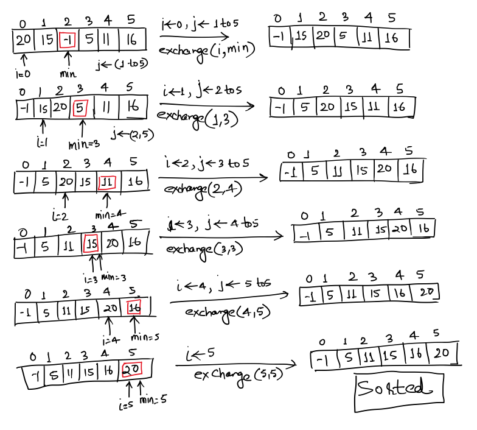
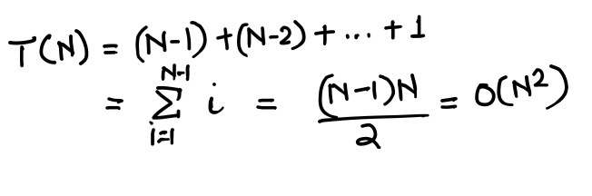
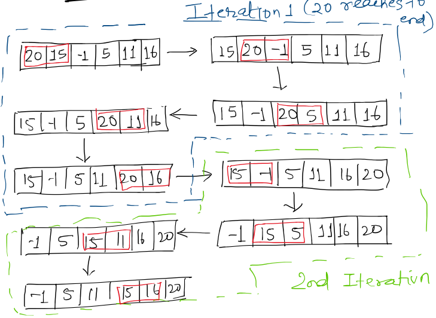
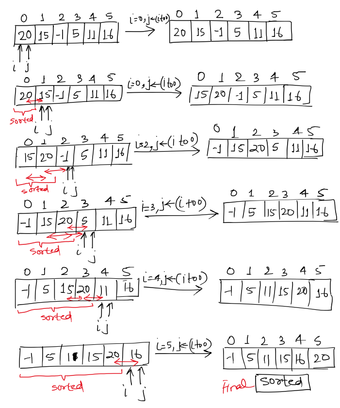
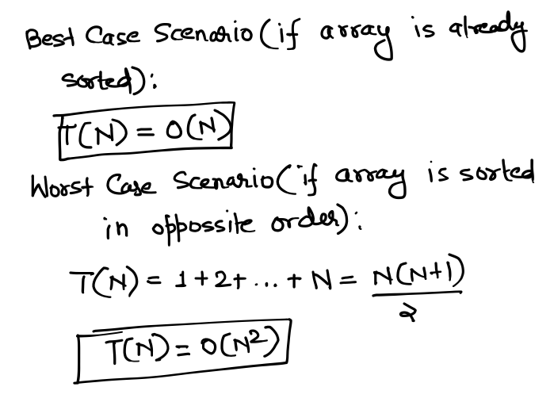
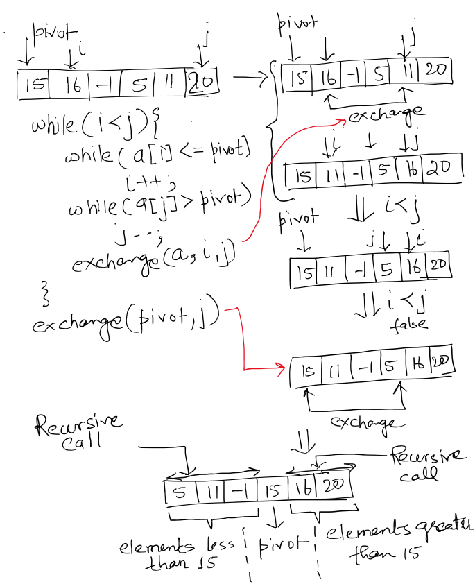
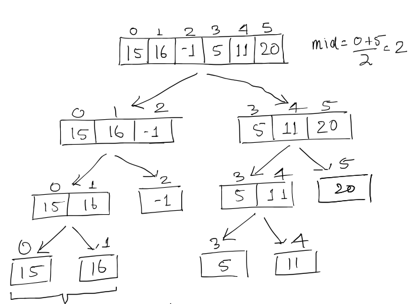
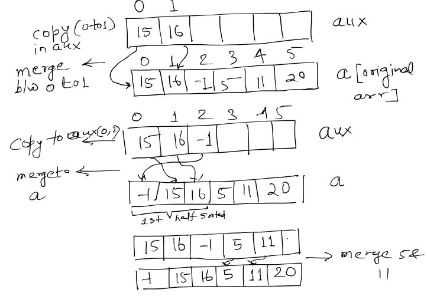
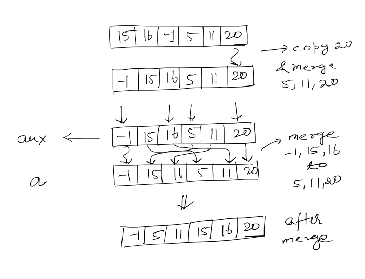
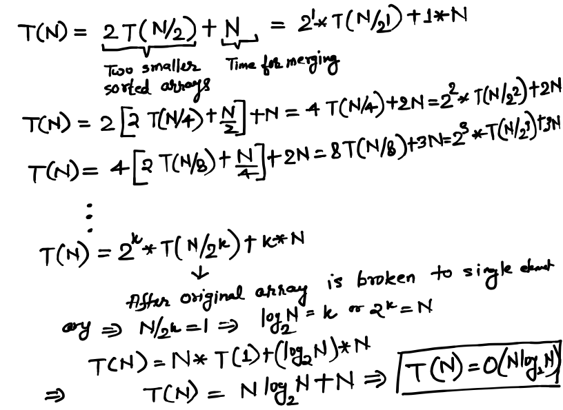

# Sorting Algorithms

### Selection Sort
Selection sort a basic search which takes O(N2) time. It tries to keep on putting the minimum value in sequence from left to right. Logic is explained below.

- **Running Time Analysis:** O(N2)
- **Space Analysis:** **In-Place** Sorting hence not extra space.
- **Is Stable?:** No, Because ordering of equal numbers can be affected. Because there is distance sort.

### Bubble Sort
Bubble sort is again a sort in which maximum element keep on moving to right most. The elements are compared pair wise and larger one is shifted to right. Hence in first iteration maximum reaches to right most location. In second iteration the second maximum reaches to second right most position and so on and so forth.

As we can see in following example, in first iteration 20 reaches to the end of array. Then in second iteration 16 which is second max is at second right position. 

- **Running Time Analysis:** O(N2)
- **Space Analysis:** **In-Place** Sorting hence not extra space.
- **Is Stable?:** No, Because ordering of equal numbers can be affected. Because there is distance sort. 

### Insertion Sort

Insertion Sort is basic algorithm but is very concise and useful sorting algorithm. It makes sure that when we are at ith position then all elements which are to the left of i will be sorted. Because at ith postion, it keeps an inner loop tracked by another pointer j which keep on decreasing and checking whether jth element is lesser than (j-1)th element. If so element will be exchanged. 

Hence if input is already sorted then it is best case of Insertion Sort, because it will be finished in O(N) time. On the other hand worst case for this is O(N2). 

**Note: If input is partially sorted then Insertion Sort can give much more better performance. Hence Shell Sort comes into picture.**

- **Running Time Analysis:** Best Case: O(N) Worst Case: O(N2)
- **Space Analysis:** **In-Place** Sorting.
- **Is Stable?:** Yes, Because there is not distance exchange of elements after comparison. So equal keys are kept in order.

### Shell Sort

Shell Sort is improvement to Insertion Sort. As we know that if partial elements in array are already sorted then Insertion Sort performs better. Hence we keep buckets or shells which we sort initially. For example: Using insertion sort we first sort elements at distance 7, then elements at distance 3 and then finally insertion sort for all elements. Which increases performance multi-folds.

- **Running Time Analysis:** Best Case: O(N), Worst Case: linearithmic i.e. O(N*logN)
- **Space Analysis:** **In-Place** Sorting.
- **Is Stable?:** No, Because while doing shell sort there can be distance exchange of elements.

### Quick Sort

Quick Sort is a ** Divide and Conquer Algorithm**. Here we identify a pivot element. All elements lesser than pivot element are kept to the left of it and all bigger elements are kept to the right of the pivot. This is a linear time operation. The same operation as described above is done again for elements to the left and elements to the right until final array is left with single element. 

- **Running Time Analysis:** Best Case: O(N\*logN), Average Case: O(N\*logN) Worst Case: O(N2)
- **Space Analysis:** **In-Place** Sorting.
- **Is Stable?:** No, because here distance exchange can happen against pivot element.

### Merge Sort

Merge Sort is another ** Divide and Conquer Algorithm**. Here we keep on dividing the unsorted array until we get single element array and then we start merging them in sorted order. But for doing this we need extra space equal to space of original array. 

- **Running Time Analysis:** Best Case: O(N\*logN), Average Case: O(N\*logN) Worst Case: O(N\*logN)
- **Space Analysis:** Not In-place. Hence it needs double space of problem size. 
- **Is Stable?:** Yes, keeps order for equal elements.

# Usage

Other than general usage of sorting algorithm one of the very good usecase is solving the problem of convex hull. i.e. identifying a convex polygon which can accomodate multiple points given inside this polygon.
