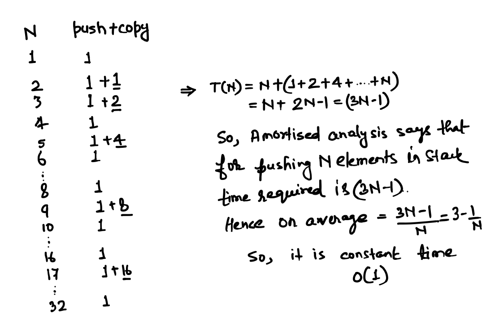

# Stack

Stack is a data structure in which data can be only kept from top and accessed from top. Like a stack of plates. 

So an element will be always added to Stack by **push(element)** and an element will be accessed by it using **pop()** operation. Hence we can only access last element pushed to a stack. That is why stack is called LIFO(Last In First Out).

# Stack ADT

```Java
public interface Stack<T> {
	public void push(T element) throws StackFullException;
	public T pop() throws StackEmptyException;
	public Boolean isEmpty();
	public Boolean isFull();
	public T top() throws StackEmptyException;
}
```
# Fixed Size Stack

All operations of FixedSizeStack implementation can be done in constant time. There is a pointer top which is always pointing to element currently on top of stack, hence push(element), pop() and top() all will take constant time O(1).

# Linked List Based Stack

#### - Time Analysis
All operations of LinkedListBasedStack implementation can be done in constant time. Because head of linkedlist always represents top of the stack.

<table style='border: 1px black solid; border-collapse: collapse'>
	<tr>
		<th style='border: 1px black solid'>Operation</th>
		<th style='border: 1px black solid'>Best Case</th>
		<th style='border: 1px black solid'>Worst Case</th>
		<th style='border: 1px black solid'>Amortized Time</th></tr>
	<tr>
	<tr>
		<td style='border: 1px black solid'>Construct</td>
		<td style='border: 1px black solid'>1</td>
		<td style='border: 1px black solid'>1</td>
		<td style='border: 1px black solid'>1</td>
	</tr>
	<tr>
		<td style='border: 1px black solid'>Push</td>
		<td style='border: 1px black solid'>1</td>
		<td style='border: 1px black solid'>1</td>
		<td style='border: 1px black solid'>1</td>
	</tr>
	<tr>
		<td style='border: 1px black solid'>Pop</td>
		<td style='border: 1px black solid'>1</td>
		<td style='border: 1px black solid'>1</td>
		<td style='border: 1px black solid'>1</td>
	</tr>
	<tr>
		<td style='border: 1px black solid'>Top</td>
		<td style='border: 1px black solid'>1</td>
		<td style='border: 1px black solid'>1</td>
		<td style='border: 1px black solid'>1</td>
	</tr>
	<tr>
		<td style='border: 1px black solid'>size</td>
		<td style='border: 1px black solid'>1</td>
		<td style='border: 1px black solid'>1</td>
		<td style='border: 1px black solid'>1</td>
	</tr>
</table>		

#### - Space Analysis

The space/memory consumed by a linked list based array will be ~32N. 

<p align="left">
  
</p>

# Array Based Stack

#### - Time Analysis

Amortized time analysis for Array Based Stack tells that on an average time taken for a push operation is constant time O(1). But in worst case it can go to O(N). 

Explanation is as follows:

<p align="left">
  
</p>


<table style='border: 1px black solid; border-collapse: collapse'>
	<tr>
		<th style='border: 1px black solid'>Operation</th>
		<th style='border: 1px black solid'>Best Case</th>
		<th style='border: 1px black solid'>Worst Case</th>
		<th style='border: 1px black solid'>Amortized Time</th></tr>
	<tr>
	<tr>
		<td style='border: 1px black solid'>Construct</td>
		<td style='border: 1px black solid'>1</td>
		<td style='border: 1px black solid'>1</td>
		<td style='border: 1px black solid'>1</td>
	</tr>
	<tr>
		<td style='border: 1px black solid'>Push</td>
		<td style='border: 1px black solid'>1</td>
		<td style='border: 1px black solid'>N</td>
		<td style='border: 1px black solid'>1</td>
	</tr>
	<tr>
		<td style='border: 1px black solid'>Pop</td>
		<td style='border: 1px black solid'>1</td>
		<td style='border: 1px black solid'>N</td>
		<td style='border: 1px black solid'>1</td>
	</tr>
	<tr>
		<td style='border: 1px black solid'>Top</td>
		<td style='border: 1px black solid'>1</td>
		<td style='border: 1px black solid'>1</td>
		<td style='border: 1px black solid'>1</td>
	</tr>
	<tr>
		<td style='border: 1px black solid'>size</td>
		<td style='border: 1px black solid'>1</td>
		<td style='border: 1px black solid'>1</td>
		<td style='border: 1px black solid'>1</td>
	</tr>
</table>								

#### - Space Analysis

For Stack which contains elements of Integer type can occupy space somewhere between N to 4N.

<p align="left">
  
</p>

# Which to pick

Between the two kinds of stacks of dynamic size which to pick is all depends on what is the requirement of client. 

If frequency of push followed by pop is not high then we may use ArrayBasedStack because over a period of time the average operations time taken is constant time. Also the space consumption is 1/8 of the space consumed by LinkedListBasedStack.

If there are too many push and then pop operations keep on happening and still we need very fast constant time operations then we can used LinkedListBasedStack and memory is not priority here. 

# Stack applications

Following applications can be implemented using Stack Data Structure:

- Back button on browser
- Function call in Programming Language
- Arithmetic Expression
- DFS Traversal in Graph

# Java provides Stack?

Java gives **java.util.Stack** which is implemented on top LinkedList. But when we use a libray which is given for general use, it may be possible that it has many operations to cater the need of all clients. So we should be knowing the underlying implementation otherwise it is recommended to use own implementation which will be lightweight and cater our need only.
   
