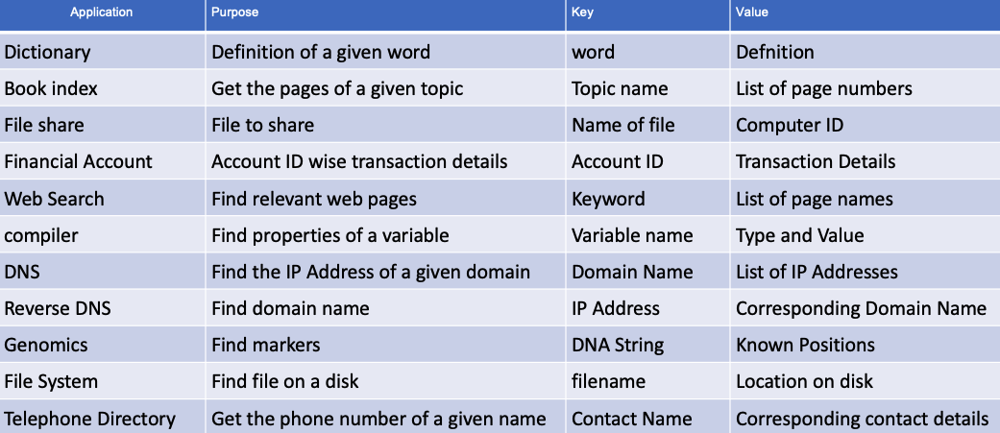
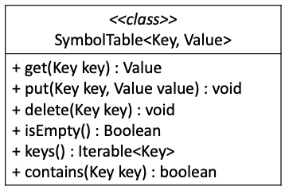
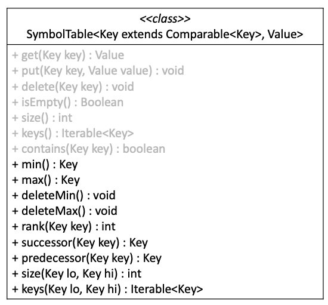
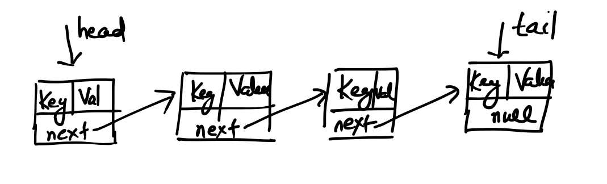
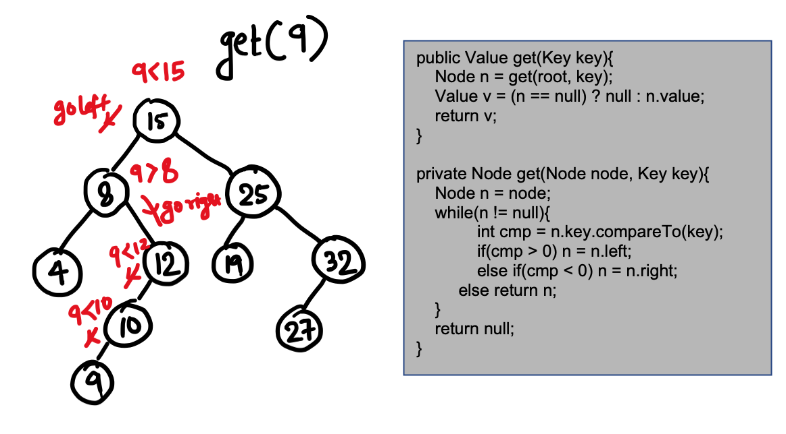
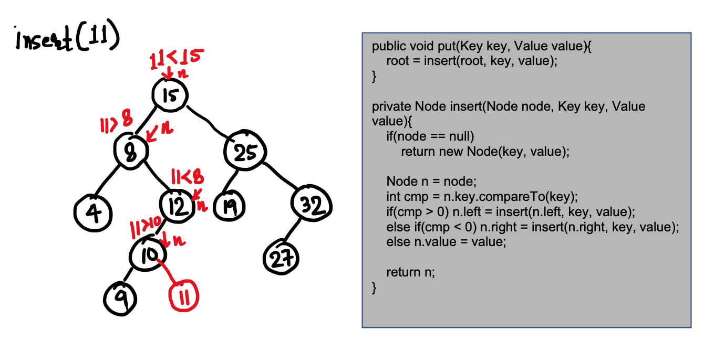
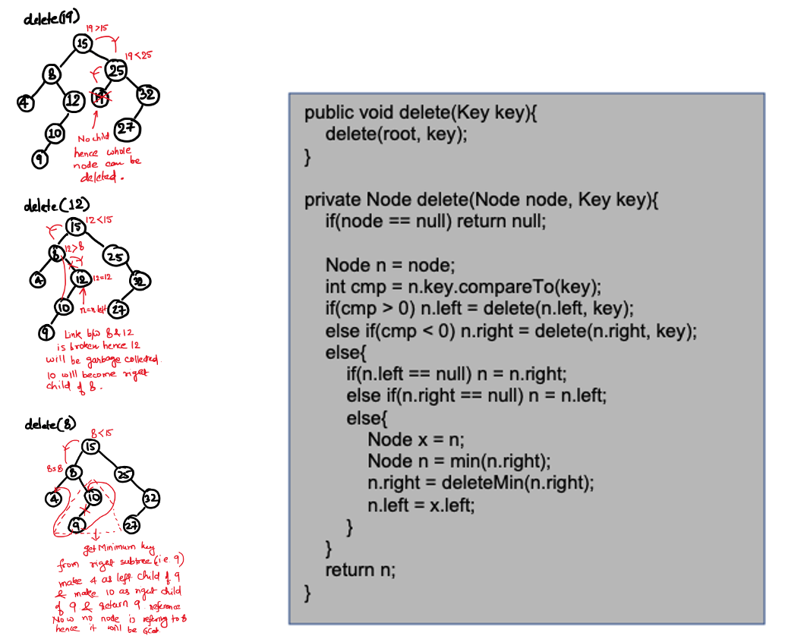
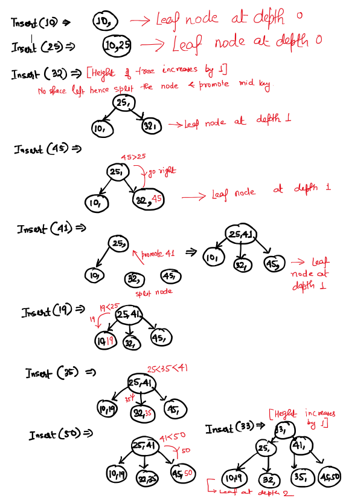
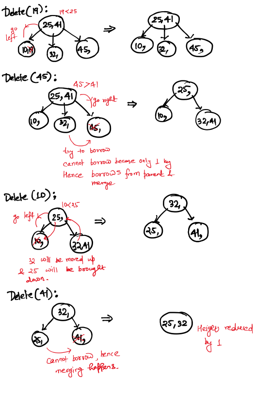

# Symbol Table

Symbol table is a data structure which contains key and value pair. Value is always associated to a key and it can be accessed for a given key. There are many practical Usecase of Symbol Table.




# Symbol Table ADT

Symbol Table data type has following basic functionality as an ADT.



But some times we may need ordered queries in key in Symbol Table in that case ADT can be as follows. We can see that basic operations are also there which are mentioned in gray color:




# Implementations of Symbol Table

### Linked List Implementation

Following diagram shows the linked list based implementation of Symbol Table. 

 

##### Pros

- Insert or put operation takes only constant time because any key-value pair can be added at head.

##### Cons

- Search/get and delete operation is very sluggish which can take O(N) time.
- Operations which are ordered in mature cannot be performed quickly. For example: min/max, successor/predecessor may take may take O(N) time. Also giving rank for all keys is very sluggish. 
 
##### Usage

Hence usually linked list based implementation is not in practice for Symbol Table. Hence we need a better implementation which gives all round performance for all kinds of operations.

### Array Based Implementation with ordered key

In case of Array Based implementation where we keep keys in **sorted order** also can be used for Symbol Table implementation. Here we have to keep two arrays one array which contains keys in sorted order and another which contains value represented by same indexes which their corresponding key are placed in first array.

##### Pros

- Search or get operation can take O(log<sub>2</sub>N) time because we can use binary search.
- Ordered operations like min/max key, successor/predecessor key, rank of a given key can be done in O(1) time. 

##### Cons

- Insert and delete operations takes O(N) time. Reason is simple we can search a key in O(log<sub>2</sub>N) time but to maintain the order we need to shift the keys to right/left which may take O(N) time in worst case.

##### Usage

If our application does not demand very frequent insert or delete then Array Based Implementation which contains key in sorted order is a good implementation for Symbol Table. 

### Binary Search Tree(BST) Based Implementation

As we know Binary Search Tree is a binary tree where key of the root is greater than all keys of its left sub tree and lesser than all the keys of its right subtree and this statement holds true recursively.

If we implement Symbol Table based on BST, we can do all operations of Symbol Table(including ordered operations) in O(H) time where H is height of the tree.

For implementation of Symbol Table based on BST can be seen in BST.java.

```Java
public class BST<Key extends Comparable<Key>, Value>{

    	private class Node{
		Key key;
		Value value;
		Node left;
		Node right;
		int count;
		
		public Node(Key key, Value value) {
			this.key = key;
			this.value = value;
		}
	}
	// All operations and their implementation
}
```

As shown in above code, BST class is exactly same as shown in ADT of Ordered Symbol Table in starting of this document(i.e. Key can be compared to do ordered operations). We can also see how given node is represented in BST based Symbol Table. 

Some of the operations are shown below:

##### get Operation

 

##### put Operation

 

##### delete Operation

 

#### Pros
- Usually the incoming keys which gets inserted to a BST are in random order and hence height of the BST is balanced and we can do all operations in approximately O(log<sub>2</sub>N). 

#### Cons
- But there is no control on order of mechanism in which client can insert keys. It can be also in increasing or decreasing order, in that case all operation will be in O(N) time because BST will behave like a linked list.

#### Usage

BST can be used as an implementation of Symbol Table but it does not give a guarantee that it will always give the O(log<sub>2</sub>N) performance. Hence in worst case depending on the way the keys are inserted to BST operations can take O(N) time complexity. Hence we look for a balanced BST.


### Balanced BST Based Implementation

As vanilla BST does not give guarantee of always getting running time of O(log<sub>2</sub>N) hence to make sure we get guaranteed performance of O(log<sub>2</sub>N) height balanced BSTs are used. 

AVL Tree, 2-3 Trees and Red Black Trees are the one which make sure that height can be kept balanced.

### AVL Tree

Check out project tree in which details of AVL Tree has been explained. It makes sure that height of AVL tree does not grow in linear fashion but it will be in logarithmic order.

### 2-3 Tree
 
2-3 Tree is a data structure have following properties:

- A node can have minimum 1 key and maximum 2 keys. Hence a node can have minimum 2 children or maximum 3 children
- All leaf nodes are always at same height
- If the key to be inserted to a node and node does not have space then node will be splitted and middle key will be promoted to parent. If parent also does not have space i.e. contains 2 keys already then parent also is splitted and mid key is promoted until a parent having space accomodates the key. If the promotion happened till root and root also dont have space then root will be splitted and mid key will be promoted and made as root. In this case **height of tree increases by 1**.
- Delete operation is just a reverse. If the node which has the key to be deleted contains 2 keys then key can be deleted from the node. But if the node has only single key and it need to be deleted then it will borrow one key from its sibling. If sibling also has only one key then the it is merged with sibling and one key is borrowed down from parent. But if the same scenario is there with parent i.e. single key then this process of borrow and merge will happen until sibling has a key or parent has key. If it reaches till root and root also has only one key the **height of the tree will be decreased by 1**.


##### Insert operation in 2-3 tree

 

##### Delete operation in 2-3 tree

 

Generalization of 2-3 tree is A-B Tree or B Trees. But usually 2-3 tree is hard to implement. 

##### Pros

Hence height of a 2-3 tree can be : **log<sub>3</sub>N &lt; height &lt; log<sub>2</sub>N**. Hence all operations in 2-3 trees can be done within height of the tree i.e. in the range of **(log<sub>3</sub>N,log<sub>2</sub>N)**.

##### Cons

Hard to implement because there are many cases to handle.


### Red Black Tree based Symbol Table Implementation


