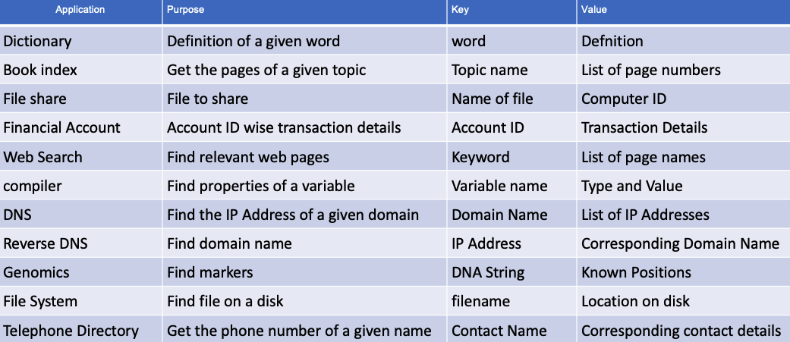
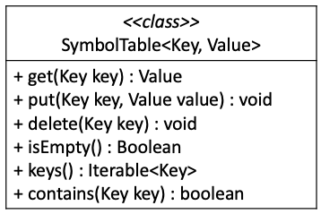
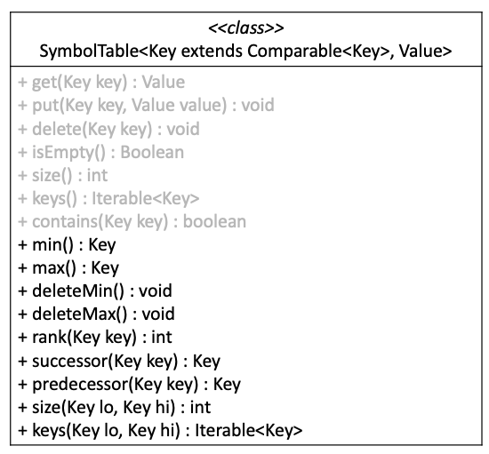
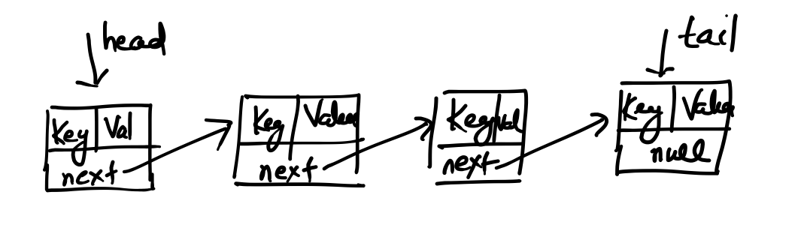
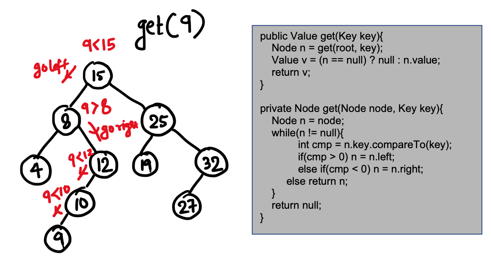
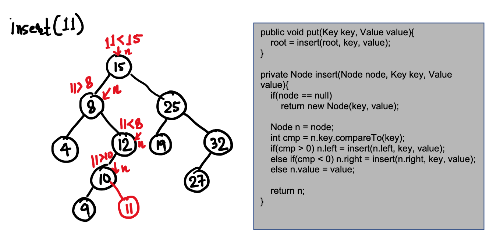
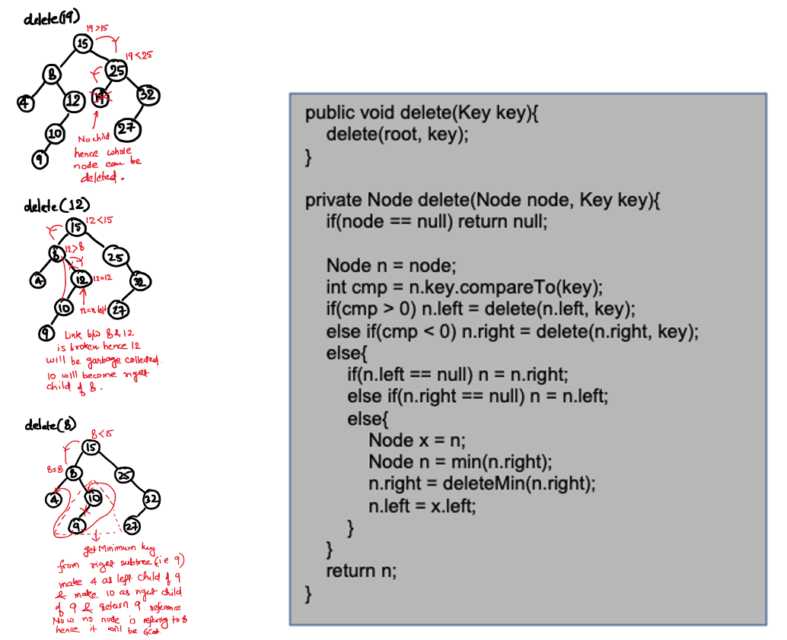

# Symbol Table

Symbol table is a data structure which contains key and value pair. Value is always associated to a key and it can be accessed for a given key. There are many practical Usecase of Symbol Table.




# Symbol Table ADT

Symbol Table data type has following basic functionality as an ADT.



But some times we may need ordered queries in key in Symbol Table in that case ADT can be as follows. We can see that basic operations are also there which are mentioned in gray color:




# Implementations of Symbol Table

### Linked List Implementation

Following diagram shows the linked list based implementation of Symbol Table. 

 

##### Pros

- Insert or put operation takes only constant time because any key-value pair can be added at head.

##### Cons

- Search/get and delete operation is very sluggish which can take O(N) time.
- Operations which are ordered in mature cannot be performed quickly. For example: min/max, successor/predecessor may take may take O(N) time. Also giving rank for all keys is very sluggish. 
 
##### Usage

Hence usually linked list based implementation is not in practice for Symbol Table. Hence we need a better implementation which gives all round performance for all kinds of operations.

### Array Based Implementation with ordered key

In case of Array Based implementation where we keep keys in **sorted order** also can be used for Symbol Table implementation. Here we have to keep two arrays one array which contains keys in sorted order and another which contains value represented by same indexes which their corresponding key are placed in first array.

##### Pros

- Search or get operation can take O(log<sub>2</sub>N) time because we can use binary search.
- Ordered operations like min/max key, successor/predecessor key, rank of a given key can be done in O(1) time. 

##### Cons

- Insert and delete operations takes O(N) time. Reason is simple we can search a key in O(log<sub>2</sub>N) time but to maintain the order we need to shift the keys to right/left which may take O(N) time in worst case.

##### Usage

If our application does not demand very frequent insert or delete then Array Based Implementation which contains key in sorted order is a good implementation for Symbol Table. 

### Binary Search Tree(BST) Based Implementation

As we know Binary Search Tree is a binary tree where key of the root is greater than all keys of its left sub tree and lesser than all the keys of its right subtree and this statement holds true recursively.

If we implement Symbol Table based on BST, we can do all operations of Symbol Table(including ordered operations) in O(H) time where H is height of the tree.

For implementation of Symbol Table based on BST can be seen in BST.java.

```Java
public class BST<Key extends Comparable<Key>, Value>{

    	private class Node{
		Key key;
		Value value;
		Node left;
		Node right;
		int count;
		
		public Node(Key key, Value value) {
			this.key = key;
			this.value = value;
		}
	}
	// All operations and their implementation
}
```

As shown in above code, BST class is exactly same as shown in ADT of Ordered Symbol Table in starting of this document(i.e. Key can be compared to do ordered operations). We can also see how given node is represented in BST based Symbol Table. 

Some of the operations are shown below:

##### get Operation

 

##### put Operation

 

##### delete Operation

 

#### Pros
- Usually the incoming keys which gets inserted to a BST are in random order and hence height of the BST is balanced and we can do all operations in approximately O(log<sub>2</sub>N). 

#### Cons
- But there is no control on order of mechanism in which client can insert keys. It can be also in increasing or decreasing order, in that case all operation will be in O(N) time because BST will behave like a linked list.

#### Usage

BST can be used as an implementation of Symbol Table but it does not give a guarantee that it will always give the O(log<sub>2</sub>N) performance. Hence in worst case depending on the way the keys are inserted to BST operations can take O(N) time complexity. Hence we look for a balanced BST.


 