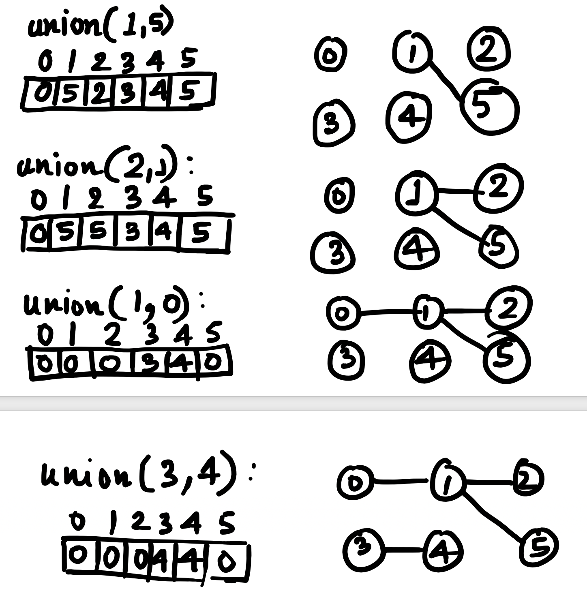
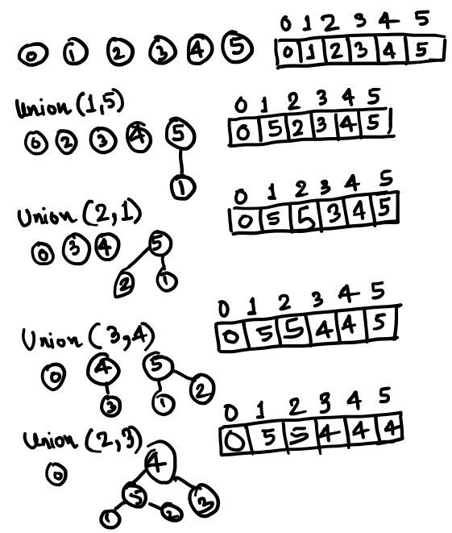
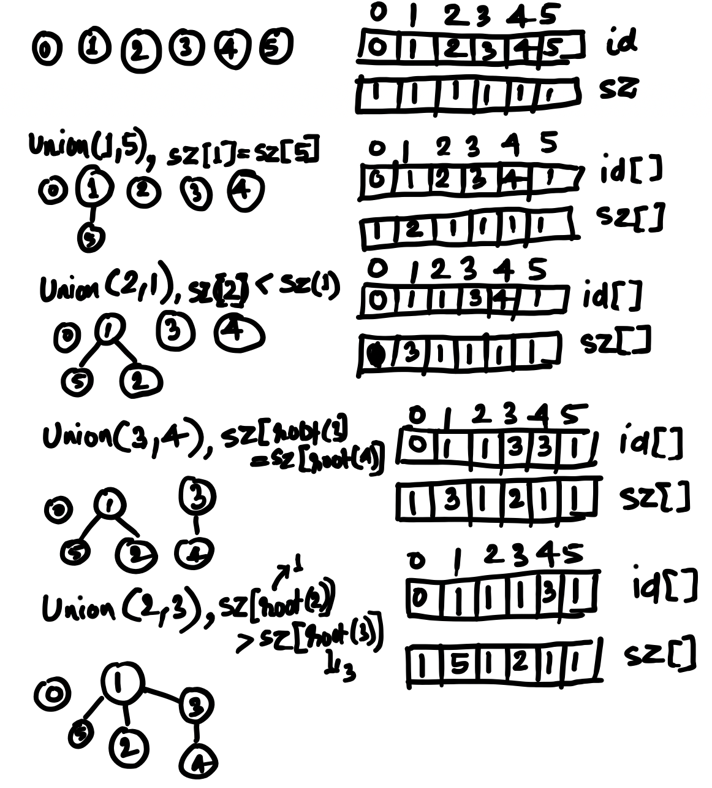
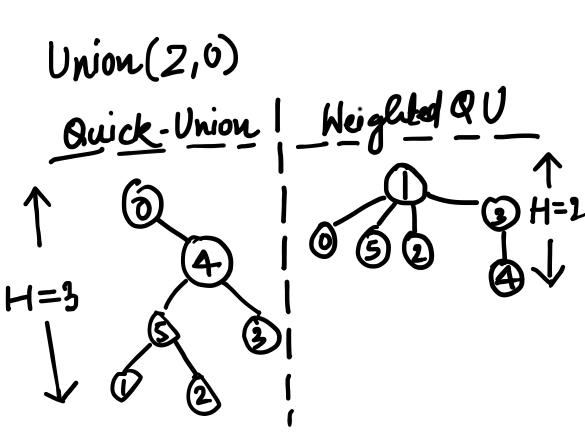
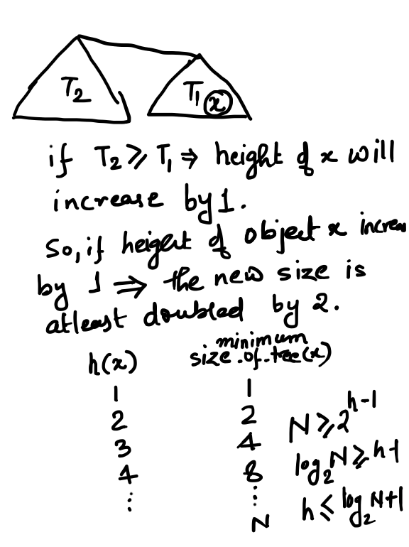

# union-find Data Type

union-find is a data type which can be used for identifying whether two objects are connected to each other or not. It solves the problem of **dynamic connectivity**. 

- Percolation
- Dynamic Connectivity
- Games(Go, Hex)
- Matlab's bwlabel() function in image processing
- Kruskal's Minimum Spanning Tree

There are many more applications as above.

# union-find ADT

union-find ADT(Abstract Data Type) gives following two functions.


```Java
public interface UF {
	void union(Integer p, Integer q);
	Boolean connected(Integer p, Integer q);
}
```

# Implementations of union-find

# quick-find(Eager Approach) implementation

quick-find implementation can be seen in QF class. 

### Initialization
First quick-find is initialized with an array which shows each and every object pointing to itself. See how id[] is initialized in the constructor. Which will take N unit of time.

```Java
public QF(int N) {
	id = new Integer[N];
	for(int i=0; i<N; i++) id[i] = i;
}
```

### union(p,q)
The union operation in quick-find approach is eager in nature. union(p,q) attaches object p directly to object q by mentioning id[p]=q. If p is attached to q, then all those objects which were attached to p need to be also connected to object q. Hence all those objects which were referring to the object which p was connected to, they are also starts referring to q. This is why in worst case scenario union(p,q) may take N unit of time i.e. O(N). 

```Java
public void union(Integer p, Integer q) {
	Integer v = id[p];
	for(int i=0; i<id.length; i++) 
		if(id[i] == v) 
			id[i] = q;
}
```

Example:
<p align="center">
  
</p>


### connected(p,q)
The connected(p,q) just checks whether both p and q are have attached to same object or not. If they are connected to same object that means they are connected otherwise not. quick-find implementation of connected(p,q) can be done in O(1) time complexity.

```Java
public Boolean connected(Integer p, Integer q) {
	return id[p] == id[q];
}
```

# quick-union(Lazy Approach) implementation

### Initialization
The initialization is exactly same as quick-find implementation.

### Helper Function - root(i)
This function is used by both union and connected functions of quick-union implementation. Since quick-union builds tree for connected objects and to identify which tree an object belongs to, is done by getting root of that tree.


```Java
private Integer root(Integer i) {
	while(i != id[i]) i = id[i];
	return i;
}
```

### union(p,q)
This is tree based implementation. union(p,q) uses helper function root(i). First function identifies root(p) is attached as child of root(q). This is a lazy approach because here p is not directly attached to q but root(p) is attached to root(q). As we can see in example diagram that the tree can grow long and hence union time can take linear time i.e. O(N).


```Java
public void union(Integer p, Integer q) {
	if(!connected(p,q))
		id[root(p)] = root(q);
}
```
 
Example:
<p align="center">
  
</p>


### connected(p,q)
To identify whether two objects are connected to each other or not, can be implemented easily by checking whether the roots of the trees which they belong to are same or not. But in contrary to constant time complexity of quick-find implementation quick-union implementation will take linear time complexity.

```Java
public Boolean connected(Integer p, Integer q) {
	return root(p)==root(q);
}
```

# weighted-quick-union(Improvement to quick-union) implementation

This technique is an improvement on quick-union algorithm. Both union and connected operation in quick-union were having O(N) time complexity. This happens because tree grows and it can grow to the total number of objects. Hence we can restrict the growth of tree by checking size of trees of two objects and always add tree with smaller size to the root of tree of bigger size. Which is not the case in plain quick-union. 

We can prove that using this approach the height of tree cannot grow more than log<sub>2</sub>N. 

### Initialization
There is a small difference between quick-union and weighted-quick-union initialization. Other than id[], there is a sz[] array maintained which shows the size of every tree.

```Java
public WeightQuickUnion(Integer N) {
	id = new Integer[N];
	sz = new Integer[N];
	for(int i=0; i<N; i++) { 
		id[i] = i;
		sz[i] = 1;
	}
}
```

### Helper Function - root(i)
This is exactly same as quick-union implementation.

```Java
private Integer root(Integer i) {
	while(i != id[i]) i = id[i];
	return i;
}
```

### union(p,q)
Here first size of each tree is retrieved from sz[] array. The tree with smaller size is attached to the root of tree with bigger size. 


```Java
public void union(Integer p, Integer q) {
	Integer i = root(p);   // root of tree where p belongs
	Integer j = root(q);   // root of tree where q belongs
	if(i != j)             // If p and q are not already connected
		if(sz[i] >= sz[j]) {    // If size of p's tree is more than size of q's tree.
			id[j] = i; sz[i] += sz[j];
		}else {
			id[i] = j; sz[j] += sz[i]; 
		}
}
```
 
Example:
<p align="center">
  
</p>


### connected(p,q)
Connected operation is exactly same as quick-union.

```Java
public Boolean connected(Integer p, Integer q) {
	return root(p)==root(q);
}
```

### Comparison b/w quick-union and weighted-quick-union

Following diagram shows how examples which have been shown above for quick-union and weighted-quick-union will be impacted as soon as union(2,0) is called as follows:

<p align="center">
  
</p>

As more and more objects grow the tree height will grow very quickly in vanilla quick-union but in weighted-quick-union it may go at max to height of log<sub>2</sub>N.

# Weighted-quick-union maximum height proof

So following proof tells that maximum height of tree can be log<sub>2</sub>N. 

<p align="center">
  
</p>
